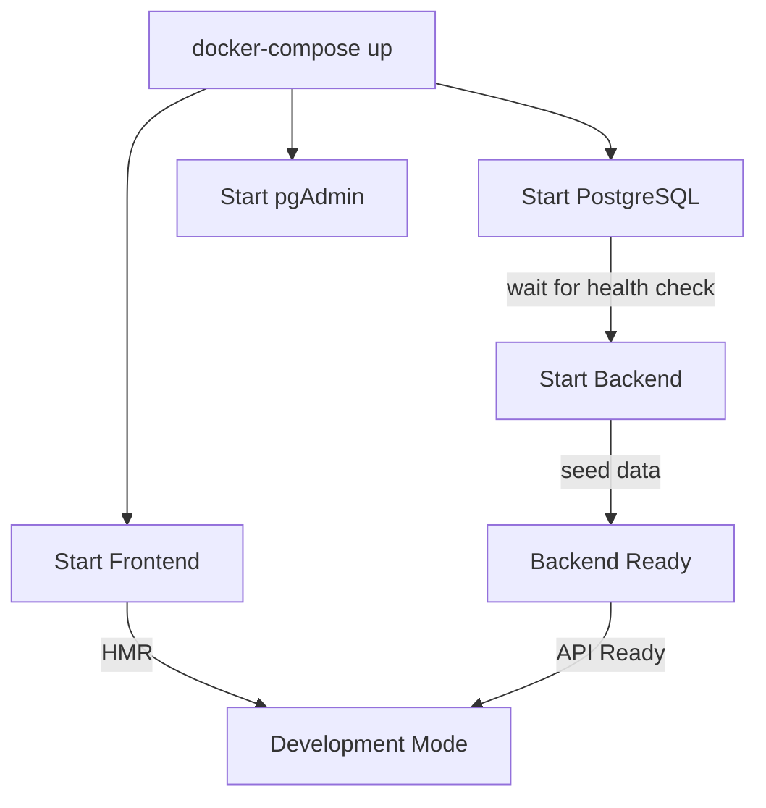

# 02 - Kiến Trúc Hệ Thống

## 🏗 Tổng Quan Kiến Trúc

Bookstore được xây dựng theo kiến trúc **Client-Server** với:
- **Frontend**: React SPA (Single Page Application)
- **Backend**: Flask REST API với cấu trúc đơn giản (Routes → Models)
- **Database**: PostgreSQL
- **Containerization**: Docker & Docker Compose

## 📐 Sơ Đồ Kiến Trúc Tổng Thể

**📊 Xem diagram chi tiết:** [`diagrams/system-architecture.mmd`](diagrams/system-architecture.mmd)

**📊 Xem data flow diagram:** [`diagrams/data-flow-diagram.mmd`](diagrams/data-flow-diagram.mmd)

## 🎯 Kiến Trúc Backend Đơn Giản

Backend được thiết kế với cấu trúc **đơn giản và dễ hiểu** để phù hợp với dự án tốt nghiệp:

### 📍 Cấu Trúc: Routes → Models

**Nguyên tắc:**
- **Routes** (`backend/routes/`) xử lý HTTP requests/responses và business logic trực tiếp
- **Models** (`backend/models.py`) định nghĩa database schema và relationships
- **Utils** (`backend/utils/`) chứa các helper functions (hash password, decorators, validation)

### 🔷 Routes Layer (Lớp Xử Lý Request)

**📍 Vị trí:** `backend/routes/`

**🎯 Nhiệm vụ:**
- Xử lý HTTP Requests/Responses
- Validate input data
- Thực hiện business logic trực tiếp
- Query database thông qua SQLAlchemy Models
- Format và trả về JSON responses
- Handle errors và exceptions

**📁 Files:**
- `auth.py` - Authentication routes (login, register, logout, profile)
- `books.py` - Book catalog routes (list, search, detail, CRUD)
- `cart.py` - Shopping cart routes (add, update, remove, get)
- `orders.py` - Order management routes (create, list, detail)
- `admin.py` - Admin panel routes (users, orders, statistics)
- `categories.py` - Category management routes
- `banners.py` - Banner management routes
- `chatbot.py` - Chatbot FAQ endpoint
- `upload.py` - File upload handling (Cloudflare R2)

**✨ Đặc điểm:**
- **Self-contained**: Mỗi route file chứa toàn bộ logic cần thiết
- **Direct database access**: Sử dụng SQLAlchemy ORM trực tiếp
- **Clear comments**: Mỗi hàm có comment giải thích flow như mã giả
- **Transaction safety**: Quản lý transaction cho các operations phức tạp (như tạo đơn hàng)

### 🔷 Models Layer (Lớp Dữ Liệu)

**📍 Vị trí:** `backend/models.py`

**🎯 Nhiệm vụ:**
- Định nghĩa database schema (SQLAlchemy ORM)
- Định nghĩa relationships giữa các bảng
- Cung cấp methods để serialize data (`to_dict()`)
- Business methods (như `generate_customer_code()`)

**📊 Models:**
- `User` - Thông tin người dùng (customers, admin)
- `Book` - Thông tin sách
- `Category` - Thể loại sách
- `Cart` - Giỏ hàng
- `Order` - Đơn hàng
- `OrderItem` - Chi tiết đơn hàng
- `Banner` - Banner quảng cáo

**✨ Đặc điểm:**
- **ORM-based**: Sử dụng SQLAlchemy để abstract database operations
- **Relationships**: Định nghĩa rõ ràng relationships (1-N, N-N)
- **Serialization**: Mỗi model có method `to_dict()` để convert sang JSON

### 🔷 Utils Layer (Lớp Tiện Ích)

**📍 Vị trí:** `backend/utils/`

**🎯 Nhiệm vụ:**
- Cung cấp helper functions dùng chung
- Decorators cho authentication/authorization
- Validation helpers
- Storage utilities (Cloudflare R2)

**📁 Files:**
- `helpers.py` - Password hashing, decorators (`@login_required`, `@admin_required`), validation
- `storage.py` - Cloudflare R2 storage operations

**✨ Đặc điểm:**
- **Reusable**: Các functions có thể dùng ở nhiều routes
- **Pure functions**: Không có side effects, dễ test

## 🔄 Luồng Dữ Liệu (Data Flow)

### Example: User Creates an Order

```
1. Frontend (React)
   └─> POST /api/orders 
       {shipping_address: "123 Street"}

2. Route Handler (routes/orders.py - create_order function)
   └─> Parse request body
   └─> Get user_id from session (đã login)
   └─> Validate shipping_address không rỗng
   └─> Bắt đầu database transaction

3. Business Logic trong Route (trực tiếp trong route function)
   └─> Query Cart items của user (Cart.query.filter_by(user_id=...))
   └─> Validate cart không rỗng
   └─> Với mỗi cart item:
       - Query Book từ database
       - Validate stock còn đủ
       - Tính tổng tiền (price * quantity)
   └─> Tạo Order mới (Order model)
   └─> Tạo OrderItems (OrderItem model)
   └─> Update stock của Books (giảm số lượng)
   └─> Xóa Cart items
   └─> Commit transaction

4. Response
   └─> Convert Order model sang dict (order.to_dict())
   └─> Return JSON response với HTTP 201 Created

5. Frontend
   └─> Receive response
   └─> Update UI, redirect to orders page
```

**Lưu ý:** Tất cả logic được thực hiện trực tiếp trong route function, không có các layer trung gian (Services, DAOs, DTOs). Code dễ đọc và dễ giải thích cho thầy cô.

## 📂 Cấu Trúc Thư Mục Chi Tiết

```
bookstore/
├── backend/                    # Flask Backend
│   ├── app.py                 # Main Flask application
│   ├── config.py              # Configuration
│   ├── models.py              # SQLAlchemy models (User, Book, Cart, Order, etc.)
│   ├── seed_data.py           # Database seeding
│   │
│   ├── routes/                # 🔷 ROUTES LAYER (Xử lý HTTP + Business Logic)
│   │   ├── __init__.py
│   │   ├── auth.py           # /api/auth/* endpoints
│   │   ├── books.py          # /api/books/* endpoints
│   │   ├── cart.py           # /api/cart/* endpoints
│   │   ├── orders.py         # /api/orders/* endpoints
│   │   ├── admin.py          # /api/admin/* endpoints
│   │   ├── categories.py     # /api/categories/* endpoints
│   │   ├── banners.py        # /api/banners/* endpoints
│   │   ├── chatbot.py        # /api/chatbot/* endpoints
│   │   └── upload.py         # /api/upload/* endpoints
│   │
│   ├── utils/                 # Utilities
│   │   ├── __init__.py
│   │   ├── helpers.py        # Helper functions (hash_password, etc.)
│   │   └── storage.py        # Cloudflare R2 storage utils
│   │
│   ├── requirements.txt       # Python dependencies
│   └── Dockerfile            # Docker config for backend
│
├── frontend/                  # React Frontend
│   ├── src/
│   │   ├── App.tsx           # Main App component
│   │   ├── main.tsx          # Entry point
│   │   │
│   │   ├── components/       # React components
│   │   │   ├── ui/          # UI components
│   │   │   ├── layout/      # Layout components
│   │   │   ├── shared/      # Shared components
│   │   │   └── auth/        # Auth components
│   │   │
│   │   ├── pages/           # Page components
│   │   │   ├── public/      # Public pages
│   │   │   ├── auth/        # Auth pages
│   │   │   └── admin/       # Admin pages
│   │   │
│   │   ├── contexts/        # React Context (State)
│   │   │   ├── AuthContext.tsx
│   │   │   └── CartContext.tsx
│   │   │
│   │   ├── services/        # API services
│   │   │   └── api.ts
│   │   │
│   │   └── types/           # TypeScript types
│   │       └── index.ts
│   │
│   ├── package.json
│   ├── vite.config.ts
│   ├── tailwind.config.js
│   └── Dockerfile.dev        # Docker config for frontend
│
├── database/
│   └── init.sql              # Reference only (SQLAlchemy creates tables)
│
├── docs/                      # Documentation
│   ├── 00-README.md
│   ├── 01-INTRODUCTION.md
│   ├── 02-SYSTEM_ARCHITECTURE.md (you are here)
│   ├── ...
│   └── diagrams/
│
├── docker-compose.yml         # Docker Compose config
└── README.md                 # Project README
```

## 🐳 Docker Architecture

### Containers

| Container | Service | Port | Volume | Purpose |
|-----------|---------|------|--------|---------|
| `bookstore_frontend` | React/Vite | 5173 | `./frontend:/app` | Frontend SPA với HMR |
| `bookstore_backend` | Flask | 5000 | `./backend:/app` | REST API Backend |
| `bookstore_db` | PostgreSQL 15 | 5432 | `postgres_data` | Main database |
| `bookstore_pgadmin` | pgAdmin 4 | 5050 | `pgadmin_data` | DB management tool |

**Note**: Object storage is handled by Cloudflare R2 (external service, not a Docker container). Public domain: `cdn.duyne.me`

### Networks

Tất cả containers được kết nối qua một Docker network: `bookstore_network`

### Volumes

- `postgres_data`: Persistent storage cho PostgreSQL
- `pgadmin_data`: Persistent storage cho pgAdmin config

**Note**: Object storage (Cloudflare R2) is external and doesn't require Docker volumes.

### Docker Compose Flow



## 🔐 Security Architecture

### Authentication Flow

```
User Login
    ↓
Frontend POST /api/auth/login {username, password}
    ↓
Backend: check_password(hashed_password, input_password)
    ↓
If valid: Create session, set session['user_id']
    ↓
Return user info (without password hash)
    ↓
Frontend: Store user in AuthContext
    ↓
Subsequent requests: Send session cookie automatically
    ↓
Backend: Check session['user_id'] with @login_required decorator
```

### Session Management

- **Storage**: Server-side session (Flask-Session)
- **Cookie**: `session` cookie với `httponly=True`
- **Expiry**: Session expires on browser close or after timeout
- **Security**: Password hashed với bcrypt

### Authorization

- **Role-based**: `admin`, `customer`
- **Decorator**: `@admin_required` for admin-only routes
- **Frontend**: `ProtectedRoute` component cho admin pages (checks role === 'admin')

## 🚀 Deployment Architecture

### Development

```
Developer Machine
└── Docker Compose
    ├── Frontend (dev mode, HMR)
    ├── Backend (auto-reload)
    ├── PostgreSQL
    └── pgAdmin

External Services:
└── Cloudflare R2 (Object Storage - cdn.duyne.me)
```

### Production (Future)

```
Production Server
├── Nginx (Reverse Proxy)
│   ├── Frontend (static files)
│   └── Backend (API proxy)
├── Gunicorn (WSGI Server)
│   └── Flask App (multiple workers)
├── PostgreSQL (external or RDS)
└── Cloudflare R2 (Object Storage - cdn.duyne.me)
```

## ⚡ Performance Considerations

### Backend Optimizations

- **SQLAlchemy ORM**: Lazy loading, eager loading when needed
- **Pagination**: All list endpoints support pagination
- **Indexing**: Database indexes trên `username`, `email`, `created_at`
- **Caching**: Session-based caching (planned: Redis)

### Frontend Optimizations

- **Code Splitting**: Route-based code splitting
- **Lazy Loading**: Dynamic imports cho pages
- **Vite**: Fast HMR và optimized production build
- **Tailwind CSS**: PurgeCSS removes unused styles

## 📊 Scalability

### Horizontal Scaling Possibilities

- **Backend**: Multiple Flask instances behind load balancer
- **Database**: Read replicas for read-heavy operations
- **Storage**: Cloudflare R2 (scalable object storage)
- **Cache**: Redis for session storage và caching

### Current Limitations

- Session storage in-memory (single instance only)
- No load balancing
- No CDN for static assets
- Single database instance

---

**📌 Key Takeaways:**
1. **Simple Architecture** (Routes → Models) dễ hiểu và dễ báo cáo
2. **Direct database access** qua SQLAlchemy ORM, không có layer trung gian
3. **Clear comments** trong mỗi hàm giải thích flow như mã giả
4. **Docker** ensures consistent development/deployment
5. **REST API** follow standard conventions
6. **Security** with password hashing và session management
7. **Transaction safety** được quản lý trực tiếp trong routes cho các operations phức tạp

